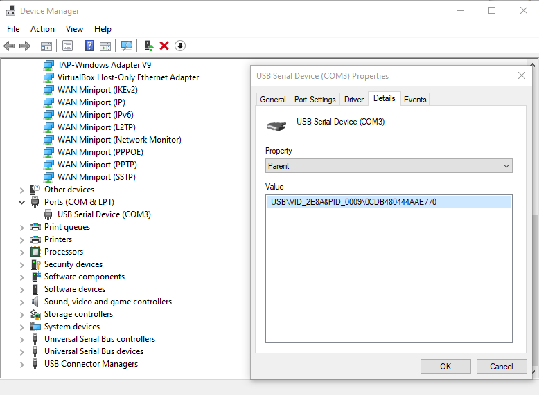

# Pico Vault

In this repository you find the files for the pico-vault challenge, all personalized based on the ID of the pico2.
To identify the ID of your pico2, you can use `lsusb verbose`:

```
$ lsusb -d 2e8a: -v | grep Serial
  iSerial                 3 0CDB480444AAE770
```

Or you can use `picotool info -d` when it is in `BOOTSEL` mode. 
For example, the output will be something like this:

```
$ picotool info -df
Tracking device serial number C97033E01601FDC4 for reboot
The device was asked to reboot into BOOTSEL mode so the command can be executed.


Device Information
 type:                 RP2350
 package:              QFN60
 chipid:               0xc97033e01601fdc4
 flash devinfo:        0x0c00
 current cpu:          ARM
 available cpus:       ARM
 secure boot:          1
 debug enable:         1
 secure debug enable:  1
 flash size:           4096K

                       The device was asked to reboot back into application mode.
```

In Windows you can find the ID in device manager:



You can find the files corresponding to the chipid of your Pico in `personalized/`.

To help you solving the challenge and checking your solution, there are some scripts in `scripts/`.

If you need to reflash the firmware, put the device into `BOOTSEL` mode (with `picotool` or by holding `BOOTSEL` button before plugging in), and then copy the `.uf2` file of your Pico ID to your Pico.

Your objectives: 

1. Reverse protection mechanism
2. Recover PIN (using cryptographic operations)
3. Obtain secret key
4. Post the secret screen with your unique values to the report

Document everything in maximum 6 pages. 

Workflow and tips: 

1. Connect the Pico to your computer and try to communicate with the Pico Vault.
2. Figure out how the PIN is verified. 
  - You will need to do some reverse engineering!
  - For your Pico ID, only the `.uf2` file is available. This is the firmware flashing format used by Pico. The `scripts/uf2_to_bin.py` can transform this to a raw binary for you, which can be loaded into Ghidra and reverse engineered.
  - Reverse engineering the raw binary is hard, because there are no symbols or other annotations available. To help you, for the Pico ID `0000000000000000`, the `.elf` file is also available, which contains a lot more metadata such as function signatures.
  - The firmware for `0000000000000000` contains real values, but specific to that Pico ID, so they will not work recover the PIN for your Pico. Once you have figured out how to bruteforce the PIN, find the values needed for the bruteforce in the raw binary of your own Pico.
3. Implement an offline bruteforce for the PIN.
  - In `scripts/pico_vault_bf_partial.py` there is already the start of a bruteforce script in Python. Figure out how to finish it.
    - All to-be-implemented parts are marked with `# Finish this`.
  - Start with how to verify a single entry, then finish the bruteforcer.
  - To verify your implementation, there might be some test vectors in the firmware.
  - The pin for Pico ID `0000000000000000` is `00000000`.
4. If you have found the PIN, enter it to the Pico Vault, and recover the private key!
  - You can check that the result is correct with `scripts/pico_vault_key_validate.py`. Give this script the private key you found in the Pico Vault, and the `ec_public.pem` corresponding to your Pico ID.

Readme update 1:

There was a small bug in the challenge due to mixing lowercase and uppercase Pico IDs. If you have managed to bruteforce a PIN, but it does not work on the device itself, please send us an email with the PIN your recovered, and then we will check manually if you found the correct PIN or not.

Tips for dealing with the binary specific to your device:

- The code running on each device is the same, but the secrets are different. Reversing the process can be done with the `0000000000000000.elf`, but the eventual bruteforce needs to be done with the values you find in the binary specific to your device.
- The binary is in uf2 format, this is compatible with the firmware flashing format for the Pico. To convert this into a "raw binary", use the `uf2_to_bin.py` script.
- You can reflash this binary (for example because your performed 100 tries and the device wiped its key) by connecting the Pico while holding the BOOTSEL button, and then copying the uf2 file to the storage device it shows up as.
- To load the raw binary into ghidra, you need to figure out the architecture (or language) and base address. In this case, you can find both by checking the "About program" in the project view of ghidra for the `0000000000000000.elf`, they are the same.
- To disassemble the main properly, you need to manually tell ghidra to disassemble from Thumb mode instead of ARM32 mode. To do this, go to the address of main, right click the first byte of that function, and choose "Disassemble - Thumb".

